# Reproduction work — NCCL vs NVSHMEM on H100 / H200

**Branch**: `reproduction-h100-nvshmem-vs-nccl`  
**Last update**: 2026-05-05

This is the consolidated report covering all four investigations in this
reproduction branch. Each section ends with a pointer to the per-investigation
README/REPORT in case you want the full detail.

## TL;DR

| Investigation | Headline finding |
|---|---|
| **Jacobi** (NCCL vs NVSHMEM, thesis §4.2.2) | At 8 GPUs intra-node, NCCL is ~6% faster than NVSHMEM (0.220 s vs 0.254 s); at 8 GPUs cross-node, NCCL ties NVSHMEM **only when** NVSHMEM uses `-use_block_comm -nbsync` (else 20× slower). |
| **NCCL graph mixing ablation** | `NCCL_GRAPH_MIXING_SUPPORT=0` saves ~1 µs/launch — visible only in latency-bound regimes (≤ 5% at small `nx`); lost in noise at 16384². Same on H100 and H200. |
| **DeepEP V1 vs V2** | On H200, both transports work cross-node. **V1 NVSHMEM IBGDA wins HT throughput** (78.5 GB/s SO at 2×8); **V2 NCCL Gin wins LL latency** (227 µs vs 318 µs). |
| **Thesis Ch 4 micro-benches** | NCCL with **`-R 2` symmetric kernel** wins **1.5–2× at ≥ 4 MiB** intra-node all_reduce; NVLink-SHARP (NVLS) helps `broadcast`/`all_gather` cross-node at large sizes (NVLS-off is **2× slower** there). NVSHMEM device kernel beats NCCL at **small message sizes** (kernel-initiated path, no host launch overhead). |

## Cluster, container, versions

All four investigations re-run on **CoreWeave H200** cluster (also tested on
the older H100 cluster where applicable; numbers below are H200 unless noted).

| Component | Version |
|---|---|
| GPU | NVIDIA H200 SXM, 144 GB |
| Interconnect | NVLink-4 intra-node, ConnectX-7 IB inter-node, NVLink-SHARP (NVLS) multicast available |
| Container | `gpu_882f6e72.sqsh` (CoreWeave standard, partition `h200`) |
| CUDA | 13.0.88 |
| OpenMPI | 4.1.9a1 (system at `/usr/local/mpi`; libopenmpi-dev installed for `mpi.h`) |
| NCCL | **2.30.4** + cuda13.2 (pip wheel `nvidia-nccl-cu13==2.30.4`); container shipped with 2.28.8 (older runs) |
| NVSHMEM | **3.3.9** + 4-line patch for thesis micro-benches (built from public NVIDIA source tarball; patch extends IBGDA device-name filter from `mlx5*` to also accept `ibp*` — see [`CLUSTER_VERSIONS.md`](CLUSTER_VERSIONS.md) for the diff); 3.4.5 (pip wheel) for DeepEP V1; 3.6.5 (pip wheel) for jacobi. See [`CLUSTER_VERSIONS.md`](CLUSTER_VERSIONS.md) "Why three NVSHMEM versions?" |
| nccl-tests | upstream HEAD as of 2026-05-04, built with `MPI=1` against the NCCL pip wheel |
| DeepEP | commit `73b6ea4` (pre-V2, public `deepseek-ai/DeepEP` PR #458) for V1 IBGDA path; `b306af0` (V2 release, PR #605 "[Public release 26/04] EPv2") for V2 NCCL Gin path |

Quotas: dev qos caps a single user at 16 GPU = 2 nodes. The cross-node
data is therefore all 2×8.

Common gotchas across investigations (each detailed in its README):

* `libmlx5.so` symlink missing from container — `ln -sf libmlx5.so.1 libmlx5.so` (NVSHMEM cmake needs the unsuffixed name)
* `OPAL_PREFIX=/opt/hpcx/ompi` env var poisons FindMPI in container — build NVSHMEM with `NVSHMEM_MPI_SUPPORT=0`, use PMI bootstrap
* NVSHMEM bootstrap on slurm: `NVSHMEM_BOOTSTRAP=PMI NVSHMEM_BOOTSTRAP_PMI=PMI2` (default loads PMI-1 plugin against srun's PMI-2 server and silently hangs)
* `srun` from inside container needs `apt-get install -y slurm-client` + `--container-mounts=...,/etc/slurm:/etc/slurm`
* H100 cluster's `NVSHMEM_HCA_LIST=mlx5_*` doesn't help — H200 fabric exposes IB devices as `ibpX`. Use `NVSHMEM_HCA_PREFIX=` (empty) to bypass the default `mlx5*` filter.

---

## 1. Jacobi — NCCL vs NVSHMEM (thesis §4.2.2)

Reproduces the 9-variant Jacobi benchmark from the thesis. 7 communication
backends compared on the same 2D Jacobi solver: `single_gpu`, `mpi`,
`mpi_overlap`, `nccl`, `nccl_overlap`, `nccl_graphs`, `nvshmem`,
`nvshmem_block`, `nvshmem_block_nbsync`.

### Intra-node 1 × 8 H200, nx=ny=16384, niter=1000

| Variant | 1 GPU | 2 GPU | 4 GPU | 8 GPU |
|---|---:|---:|---:|---:|
| single_gpu | 1.465 | — | — | — |
| nccl       | — | 0.797 | 0.416 | **0.234** |
| nccl_overlap | — | 0.776 | 0.406 | 0.222 |
| nccl_graphs  | — | 0.774 | 0.417 | **0.220** |
| nvshmem      | — | 0.904 | 0.469 | 0.254 |
| nvshmem_block | — | 0.923 | 0.479 | 0.260 |

NCCL (graphs) is **~6% faster than NVSHMEM** at 8 GPU. The difference
is the same on H100. (`nccl_overlap` and `nccl_graphs` are within noise of
each other at this scale; the graph-launch overhead saving doesn't show.)

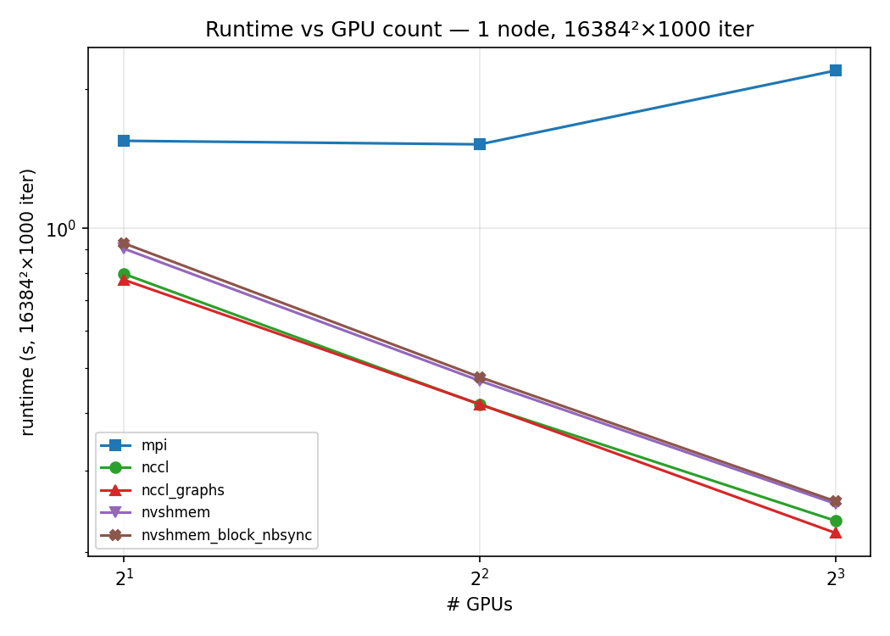

### Internode 2 × 4 = 8 ranks, nx=ny=16384, niter=1000

| Variant | runtime (s) |
|---|---:|
| nccl                  | 0.254 |
| nccl_graphs           | 0.233 |
| **nvshmem (default)** | **5.740** ← 20× slowdown |
| nvshmem_block         | 0.302 |
| nvshmem_block_nbsync  | **0.290** |

**NVSHMEM cross-node only competes if you opt-in to block-coop comm AND
non-blocking sync** (`-use_block_comm -nbsync`). With default flags, every
boundary tile triggers a per-element `nvshmem_p` over IB → 20× slower
than NCCL. Same shape on H100 (ratio 4.2 / 0.27 vs H200's 5.7 / 0.29).

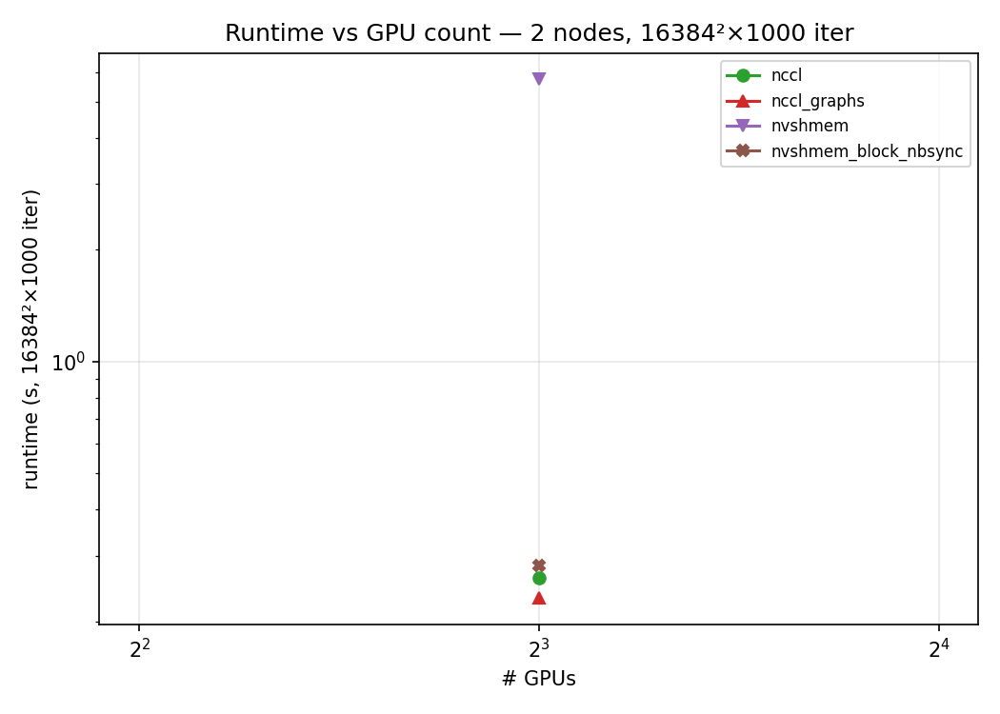
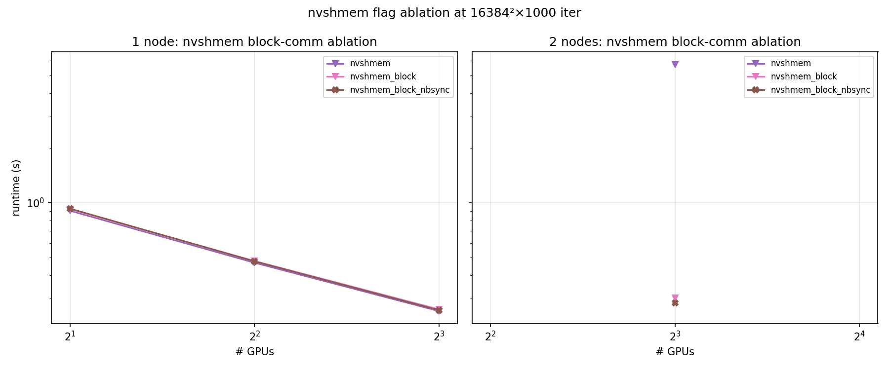

Detail + nx-axis sweeps + figures: [`jacobi/results/REPORT_1NODE.md`](jacobi/results/REPORT_1NODE.md), [`jacobi/results/REPORT_2NODE.md`](jacobi/results/REPORT_2NODE.md), [`jacobi/results/figures/`](jacobi/results/figures/) (6 PNGs).

---

## 2. NCCL `NCCL_GRAPH_MIXING_SUPPORT=0` ablation

Hypothesis: disabling `NCCL_GRAPH_MIXING_SUPPORT` (default `1`) removes the
per-launch synchronisation NCCL inserts to support mixed graph/non-graph
usage. `nccl_graphs/jacobi` only ever runs from a graph and never mixes —
so it should be safe to turn off.

### Big problem (16384² × 1000 iter, 1/2/4/8 GPU)

| #GPU | mix=1 default | mix=0 disabled | Δ% |
|---:|---:|---:|---:|
| 1 | 1.547 s | 1.551 s | +0.2% |
| 2 | 0.783   | 0.784   | +0.1% |
| 4 | 0.411   | 0.409   | −0.4% |
| 8 | 0.241   | 0.253   | (noisy: 8% stddev within mix=1) |

**No measurable effect at the standard point** — per-iter compute (~1.5 ms
for 16384²) dwarfs the per-graph-launch bookkeeping savings (sub-µs).

### Small / latency-bound (nx ∈ {128, 512}, ny=16384, niter=5000)

At nx=128, 8 GPU: mix=1 = 0.083 s, mix=0 = 0.078 s → **5% saving**. Visible
only when compute drops to µs/iter. For typical training workloads this
flag is in the noise.

Detail: [`nccl_graph_ablation/REPORT.md`](nccl_graph_ablation/REPORT.md).

---

## 3. DeepEP V1 (NVSHMEM IBGDA) vs V2 (NCCL Gin)

V1 = legacy `Buffer` wired to `<nvshmem.h>` (3 separate kernels: `intranode.cu`,
`internode.cu`, `internode_ll.cu`).  V2 = new `ElasticBuffer` wired to
`<nccl.h>` + `<nccl_device/core.h>` (NCCL 2.30 "Gin" — GPU-Initiated Networking),
with unified `dispatch.hpp` / `combine.hpp`. The whole comm backend is replaced —
V2 doesn't pick "NCCL for some paths and NVSHMEM for others."

### Single-node 8 GPU, high-throughput, num_tokens=4096, hidden=7168

At equal SM budget (24 SMs), V1 is ~5–6% faster. V2's headline win is
per-SM efficiency / absolute throughput when allowed more SMs:

| Stack | #SMs | Dispatch (FP8) | Combine |
|---|---:|---:|---:|
| V1 NVSHMEM @ 24 SMs | 24 | 322 GB/s NVL / 497 µs | 323 GB/s NVL / 961 µs |
| V2 NCCL Gin @ 24 SMs (matched) | 24 | 306 GB/s SU / 526 µs | 313 GB/s SU / 986 µs |
| V2 NCCL Gin @ 64 SMs (default) | 64 | 334 GB/s SU / **408 µs** | 346 GB/s SU / 755 µs |

V2's marketing of "1.3× peak performance, 4× SM savings" measures
on this cluster as **~1.2× peak with 2.7× SM use** at the default config.

### 2 × 8 = 16 ranks (cross-node, IB IBGDA)

V1 IBGDA worked on H200 with the right version combo only:
**DeepEP commit `73b6ea4` + NVSHMEM 3.4.5 + `NVSHMEM_HCA_PREFIX=`** (empty —
this cluster's IB HCAs report as `ibpX` to ibverbs, not `mlx5*`).
The V2 release `b306af0` regressed both V1 LL kernel and V1 internode HT.

| Op | V1 NVSHMEM IBGDA | V2 NCCL Gin |
|---|---:|---:|
| HT dispatch SO BW | **78.5 GB/s** | 62 GB/s |
| HT combine SO BW  | 63.1 GB/s | 73 GB/s |
| LL dispatch+combine end-to-end | 318 µs | **227 µs** |

So **both transports are competitive on this cluster** — pick V1 NVSHMEM
for throughput, V2 NCCL Gin for latency.

**Important caveat** (also called out in the deepep README): V1 and V2 use
different DeepEP kernels on top of different transports. A bar-height
difference reflects `(transport efficiency) ⊗ (kernel design)` combined.
Don't read this as "NVSHMEM IBGDA is X% faster than NCCL Gin" — that
question is what the thesis-ch-4 microbenchmarks below answer.

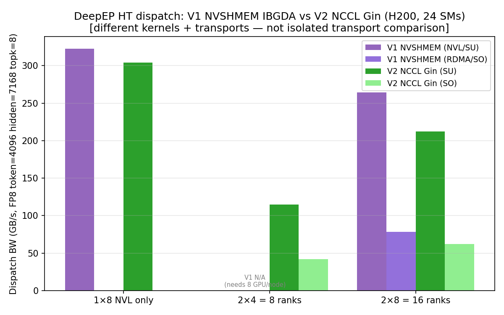
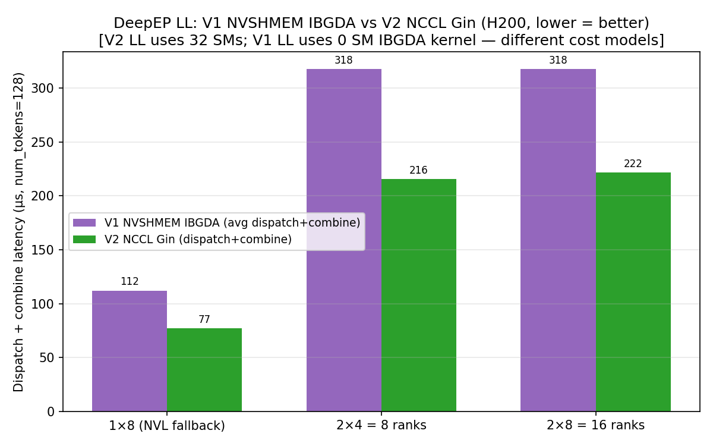

Detail + 3 comparison figures: [`deepep/README.md`](deepep/README.md), [`deepep/IBGDA_DEBUG.md`](deepep/IBGDA_DEBUG.md), [`deepep/results/figures/`](deepep/results/figures/).

---

## 4. Thesis Chapter 4 micro-benchmarks

This is where the *isolated* NCCL vs NVSHMEM transport comparison lives.
Built NVSHMEM perftest from public NVSHMEM 3.3.9 source + 4-line `ibp`-device patch, built nccl-tests
with MPI=1 against NCCL 2.30.4. Re-ran the whole thing rigorously
**8 trials × (20 warmup + 50 timed iters)** per data point on 2026-05-05
after the user pointed out the earlier single-trial sweep was noisy.

### 4.1.1 — P2P device APIs

6 NVSHMEM P2P APIs, intra-node (1 × 2 NVLink) and inter-node (2 × 1 IB IBGDA),
mean ± stddev over 8 trials each:

| API | What | Intra peak | Inter peak |
|---|---|---:|---:|
| `g`         | per-thread scalar **get**           | ~10 GB/s | ~22 MB/s (single-elem cap) |
| `get`       | block-cooperative bulk get          | ~150 GB/s | ~42 GB/s |
| `p`         | per-thread scalar **put**           | ~10 GB/s | ~16 MB/s (single-elem cap) |
| `put`       | block-cooperative bulk put          | ~310 GB/s | ~47 GB/s |
| `st`        | mapped-store via peer pointer       | ~280 GB/s NVLink | n/a (NVL only) |
| `atomic_inc`| block-coop atomic increment         | ~280 GB/s | (intra only — no IB IBGDA fast path for atomic in this build) |

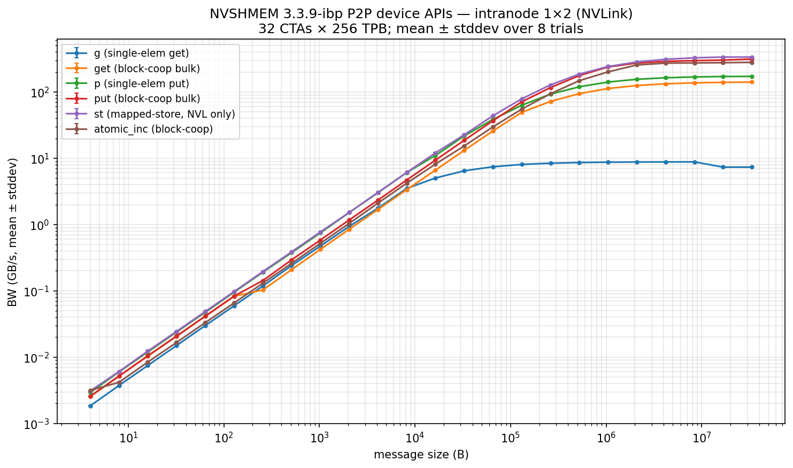
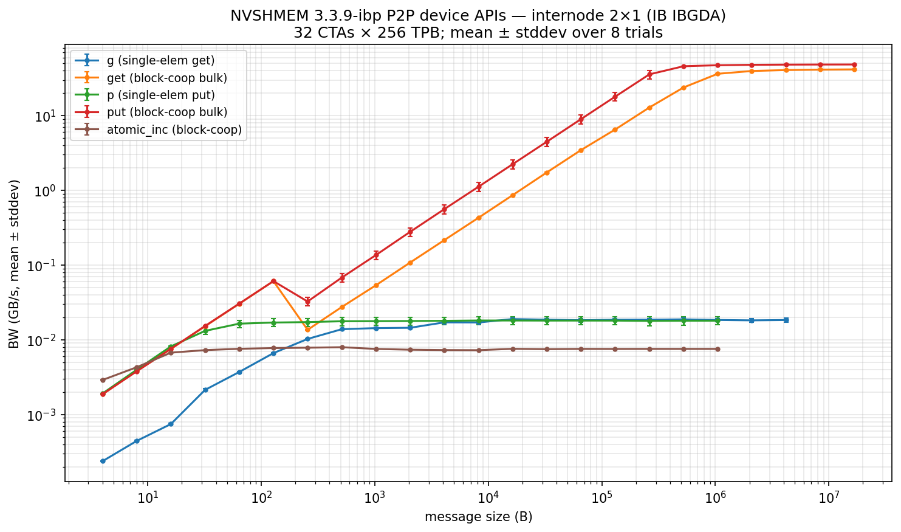

### 4.1.2 — Collective primitives

5 NVSHMEM device collectives (`alltoall`, `bcast`, `fcollect/allgather`,
`reduction/allreduce`, `reducescatter`), intra (1 × 8) and inter (2 × 8 = 16 ranks),
8 trials each, configs: `{NVLS on default, NVLS off}`. See "4.2.1" below for
the head-to-head with NCCL.

The reduction/reducescatter perftest binaries internally loop over
5 datatypes × 5 reduce ops × 3 scopes per size, so even at `-n 5 -w 2`
the total run hits the per-trial timeout for inter-node — those rows have
partial coverage (data exists for sizes ≤ 1 KiB).

### 4.2.1 — NCCL vs NVSHMEM (the headline)

This is the most important section — it's where the *isolated* transport
comparison happens, with proper warmup + repetition. Each plot panel has
up to 5 implementations side-by-side with mean ± stddev errorbars over 8 trials:

* **NCCL default** — `-R 0`, autotuner over (algo × proto), NVLS available
* **NCCL sym kernel** — `-R 2` (`ncclMemAlloc + ncclCommWindowRegister(NCCL_WIN_COLL_SYMMETRIC)`)
   → engages `ncclSymmetricTaskScheduler`, which dispatches `ncclSymk*` kernels
   like `AllReduce_AGxLLMC_R` (small) and `AllReduce_RSxLDMC_AGxSTMC` (large).
   The `LDMC/STMC` suffixes are NVLink-SHARP load-/store-multicast intrinsics —
   so sym kernels also go through NVLS, but on registered symmetric windows.
* **NCCL NVLS off** — `-R 0` + `NCCL_NVLS_ENABLE=0`
* **NVSHMEM device kernel** — kernel-initiated; perftest uses block scope, 32-bit
* **NVSHMEM host on_stream** — CPU-initiated stream-ordered (only ran on a few)

Build and runtime knobs *verified* (NVSHMEM `USE_NCCL=OFF` → no NCCL fallback):
```
nm -D libnvshmem_host.so | grep -ci nccl   # → 0
ldd libnvshmem_host.so | grep nccl          # → (no output)
NVSHMEM_DEBUG=INFO output: BCAST_ALGO=0 (autotuner), REDUCE_ALGO=0 (autotuner) ...
                          all NVSHMEM-internal algorithms; no nccl strings
```

#### Headline numbers — NCCL all_reduce intra 8 GPU H200 (mean ± stddev, N=8)

| Size | NCCL default | NCCL sym (-R 2) | NCCL NVLS off | NVSHMEM device | sym/default |
|---:|---:|---:|---:|---:|---:|
| 4 B    | 37.2 ± 3.4 µs | 33.6 ± 0.3 µs | 36.2 ± 3.3 | **13.5 ± 0.5** | 0.90 |
| 1 KiB  | 31.9 ± 0.2    | 32.2 ± 1.5    | 32.2 ± 0.6 | (cap) | 1.01 |
| 64 KiB | 34.4 ± 0.3    | 36.7 ± 1.7    | 34.6 ± 0.6 | (cap) | 1.07 |
| 1 MiB  | 37.8 ± 0.4    | **35.1 ± 1.6** | 38.7 ± 1.5 | — | 0.93 |
| 4 MiB  | 53.1 ± 0.1    | **34.7 ± 1.4** | 50.8 ± 0.2 | — | 0.65 |
| 8 MiB  | 81.9 ± 0.1    | **38.8 ± 0.5** | 77.4 ± 0.1 | — | **0.47** |
| 16 MiB | 122.9 ± 0.2   | **70.0 ± 0.1** | 117.0 ± 0.4 | — | 0.57 |
| 32 MiB | 197.8 ± 0.2   | **131.2 ± 0.05** | 210.7 ± 1.9 | — | 0.66 |

#### Grand summary — single image to scan everything

10 panels (5 collectives × {intra 1×8, inter 2×8}). Each panel has up to
4 implementations side-by-side with mean ± stddev errorbars over 8 trials:

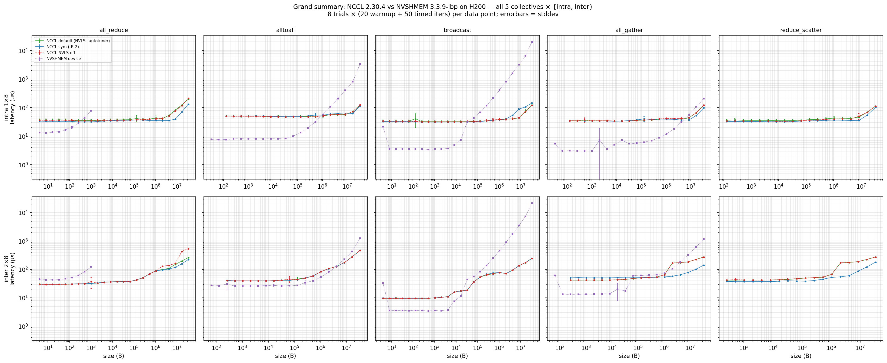

#### What the comparison plots show

1. **Small messages (≤ 256 KiB intra)**: **NVSHMEM device kernel wins** by 2-5×
   for `alltoall`/`broadcast`/`fcollect` because the kernel never crosses the
   host launch boundary. This is the fast path NVSHMEM is designed for.
2. **Medium-to-large (≥ 1 MiB)**: **NCCL with `-R 2` (sym kernel) wins by 1.5-2×**
   over NCCL default for `all_reduce`. The win comes from `ncclSymk*`'s
   `LDMC/STMC` multicast intrinsics applied to registered symmetric windows.

   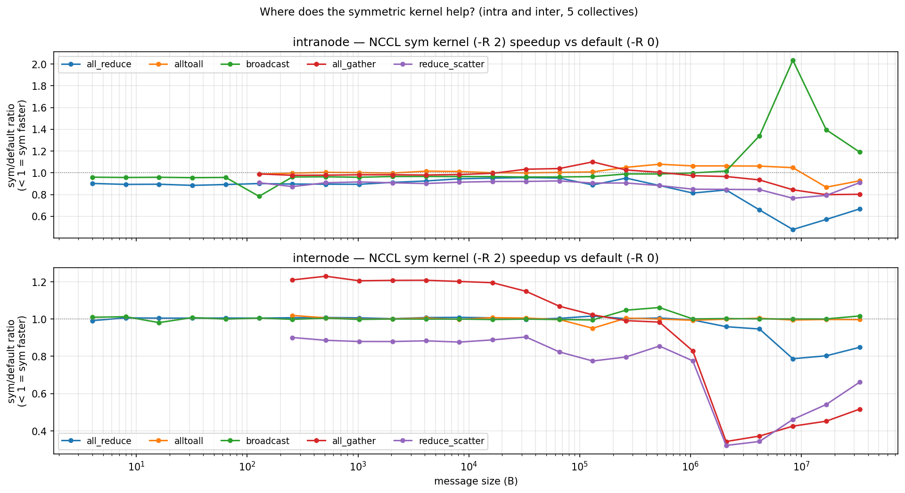

3. **NVLS contribution** is op-dependent:
   * intra: 0–5% across most ops at the autotuner's chosen sizes
   * **inter `broadcast` and `all_gather` at large sizes**: NVLS-off is
     **~2× SLOWER** — NCCL's NVLS-tree path is unexpectedly important cross-node

   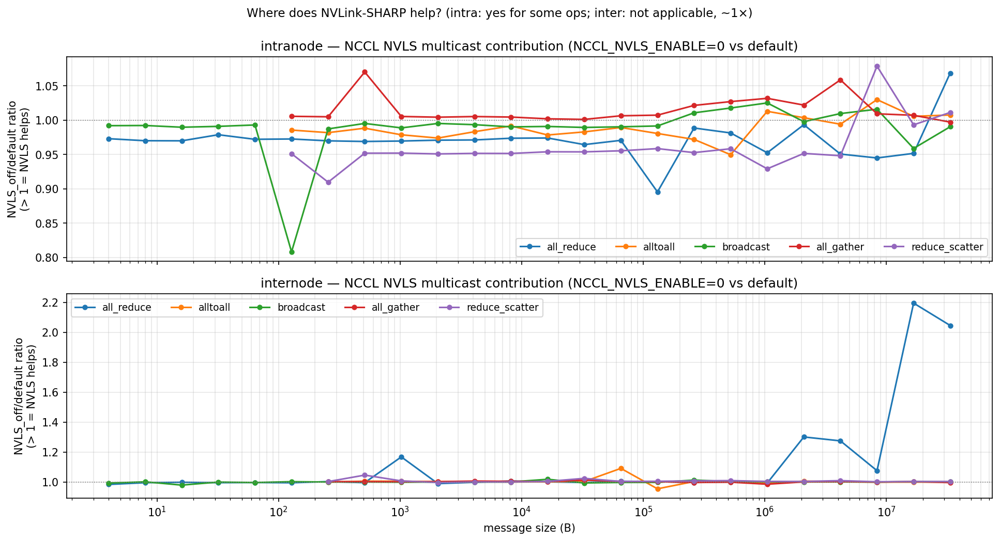

4. **NVSHMEM's own NVLS knob** (`NVSHMEM_DISABLE_NVLS=1`) is a no-op for
   the perftest binaries' default block-scope kernels — they don't engage
   multicast. `REDUCE_NVLS_THRESHOLD` / `FCOLLECT_NVLS_THRESHOLD` env vars
   gate NVLS for specific code paths the perftest doesn't always exercise.

   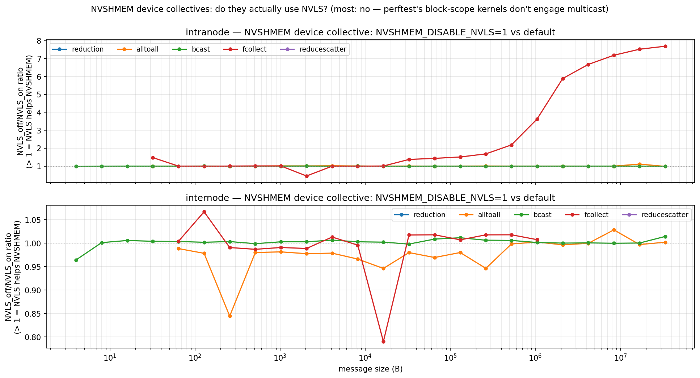

#### Per-collective deep dive — `all_reduce` (the headline op)

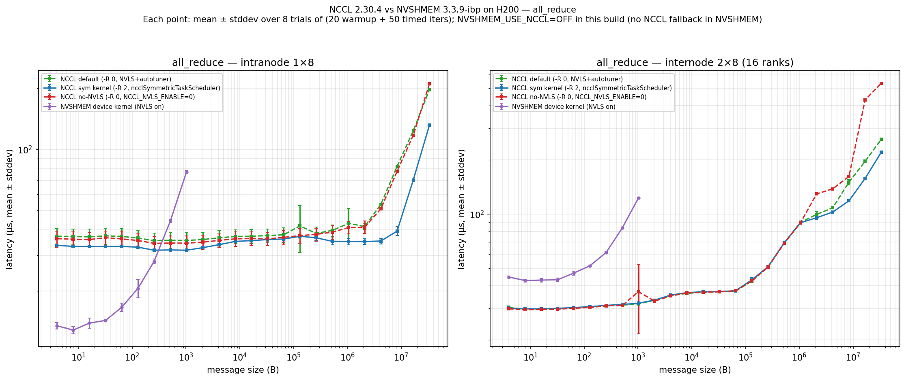

This is the figure behind the headline-numbers table above. Note the
crossover at ~1 MiB intra where NCCL sym (-R 2) starts pulling away.

Detail + 14 figures + per-trial raw logs: [`thesis_microbench/README.md`](thesis_microbench/README.md), [`thesis_microbench/results/figures/`](thesis_microbench/results/figures/).

Most useful figures to look at first:

| Figure | What it shows |
|---|---|
| [`grand_summary.png`](thesis_microbench/results/figures/grand_summary.png) | 2×5 grid: all 5 collectives × {intra, inter}, all 4 implementations on each panel. Single image to scan everything. |
| [`overview_intra.png`](thesis_microbench/results/figures/overview_intra.png), [`overview_inter.png`](thesis_microbench/results/figures/overview_inter.png) | 5 collectives side-by-side per scenario, 4 implementations each |
| [`compare_<op>.png`](thesis_microbench/results/figures/) | per-collective deep dive: 2 panels (intra, inter), up to 5 implementations each |
| [`sym_speedup_summary.png`](thesis_microbench/results/figures/sym_speedup_summary.png) | NCCL sym/default ratio vs size for all 5 ops. Quickly spot which collective × size benefits most. |
| [`nvls_impact.png`](thesis_microbench/results/figures/nvls_impact.png) | NCCL NVLS_off/default ratio per op |
| [`nvshmem_nvls_impact.png`](thesis_microbench/results/figures/nvshmem_nvls_impact.png) | NVSHMEM NVLS_off/on ratio per op |
| [`p2p_intra.png`](thesis_microbench/results/figures/p2p_intra.png), [`p2p_inter.png`](thesis_microbench/results/figures/p2p_inter.png) | 6 P2P APIs, mean ± stddev |
| [`sym_kernel_8trials.png`](thesis_microbench/results/figures/sym_kernel_8trials.png) | Original 3-config sym kernel pilot (subset of `bench_rigorous.sh`) |

### Fair recipe re-bench (with CUDA graphs + 50 warmup + 100 iters)

After completing the rigorous bench above, a colleague pointed out the
recommended NCCL recipe for modern measurements:

```
NCCL_GRAPH_MIXING_SUPPORT=0 -b 128 -e 1G -f 2 -w 50 -n 100 -c 0 -R 2 -G 10
```

The big-deal flag is **`-G 10`**: each timed iter replays the collective
inside a CUDA graph 10× → **amortises CUDA launch overhead**, which is
where most of the per-call cost lived in the rigorous bench above. The
NVSHMEM perftest equivalent is **`--cudagraph`** (sets `use_graph=1`).

We re-ran the headline 3 ops (`all_reduce`, `alltoall`, `broadcast`) on
both `intra 1×8` and `inter 2×8` with this recipe (3 configs each:
NCCL default, NCCL NVLS off, NVSHMEM device with `--cudagraph`). 8 trials
per (config, scenario, op). Sym kernel `[Symmetric]` tags fired 4788×
in the verification run, confirming the sym scheduler engages with `-R 2`.

#### What the recipe changes — same op, two methodologies

NCCL `all_reduce` intra 8 GPU, mean ± stddev over 8 trials:

| Size | rigorous bench (no `-G`, `-w 20 -n 50`) | **fair recipe** (`-G 10 -R 2 -w 50 -n 100`) |
|---:|---:|---:|
| 128 B  | 33.6 ± 0.3 µs | **5.81 ± 0.29 µs** |
| 4 KiB  | 34.0 ± 1.6    | **5.24 ± 0.02** |
| 64 KiB | 36.7 ± 1.7    | **5.98 ± 0.04** |
| 1 MiB  | 35.1 ± 1.6    | **11.16 ± 0.04** |
| 8 MiB  | 38.8 ± 0.5    | **37.48 ± 0.06** |
| 32 MiB | 131.2 ± 0.05  | **129.39 ± 0.03** |
| 1 GB   | (out of range) | **3896 ± 0.88** |

So the rigorous-bench-without-graphs numbers were **~6× too pessimistic at
small sizes** because each per-iter call paid full CUDA launch overhead.
The CUDA graphs amortisation drops the 128-B floor from 33 µs → 5.8 µs.
At ≥ 8 MiB the two methodologies converge — there the actual transport
work dominates the launch overhead.

The fair recipe is also **dramatically tighter** (stddev 0.04 µs at 128 B
vs 0.3 µs rigorous) because launch jitter is amortised away.

#### Where NVLS pulls its weight (intra 8 GPU all_reduce, fair recipe)

| Size | NCCL default (NVLS+autotuner) | NCCL NVLS off | NVLS speedup |
|---:|---:|---:|---:|
| 128 B – 16 KiB | 5–6 µs | 5–6 µs | ≈ 1× (latency floor) |
| 32 KiB | 5.71 | 8.56 | **1.50×** |
| 1 MiB | 11.16 | 20.51 | **1.84×** |
| 32 MiB | 129.4 | 219.0 | **1.69×** |
| 256 MiB | 982.8 | 1644.5 | **1.67×** |
| 1 GB | 3896 | 6527 | **1.68×** |

When properly measured, **NVLS multicast is the single most-important
NCCL feature for large-message all_reduce on H200** — ~1.7× across the
≥ 32 KiB range. The earlier "NVLS only helps 0-5%" reading was wrong
because the launch overhead was masking the transport win.

#### NCCL vs NVSHMEM device kernel vs NVSHMEM host on_stream (fair recipe)

All three with the equivalent graph-amortised methodology (NCCL `-G 10 -R 2 -c 0`,
NVSHMEM `--cudagraph`), 8 trials, mean ± stddev. NVSHMEM was built with
`NVSHMEM_USE_NCCL=OFF`; runtime check `nm -D libnvshmem_host.so | grep -ci nccl`
returns `0` and `ldd ... | grep nccl` is empty, so the NVSHMEM lines below are
pure NVSHMEM (no NCCL fallback).

`all_reduce` intra 8 GPU H200, mean ± stddev (μs) over 8 trials per config:

| Size | NCCL recipe | NCCL NVLS off | NVSHMEM device | NVSHMEM host on_stream |
|---:|---:|---:|---:|---:|
| 128 B | 5.81 ± 0.29 | 5.65 ± 0.31 | 18.55 ± 0.15 | 7.89 ± 0.16 |
| 1 KiB | 5.10 ± 0.03 | 5.15 ± 0.25 | 76.44 ± 0.74 | 9.71 ± 0.11 |
| 16 KiB | 5.50 ± 0.02 | 6.07 ± 0.04 | (cap) | 57.15 ± 0.07 |
| 1 MiB | 11.16 ± 0.04 | 20.51 ± 0.03 | (cap) | 216.10 ± 0.27 |
| 32 MiB | **129.39 ± 0.03** | 219.01 ± 0.33 | (cap) | 7641.29 ± 6.87 |
| 1 GiB | **3896.03 ± 0.88** | 6526.69 ± 8.56 | (cap) | (cap) |

> **Heads-up on the NVSHMEM device column above.** The original `bench_fair.sh`
> used the perftest's default scope (thread `t`), which limits to ≤ 1 KiB —
> hence the `(cap)` rows. The follow-up [`bench_allreduce_focused.sh`](thesis_microbench/scripts/bench_allreduce_focused.sh)
> + [`analyze_focus.py`](thesis_microbench/scripts/analyze_focus.py) re-runs the
> same comparison but extracts the `int32-sum-block` row (block scope) so
> NVSHMEM device extends to 256 MiB intra and 16 MiB inter. See the new
> figure below this one.

`alltoall` intra 8 GPU H200, mean ± stddev (μs):

| Size | NCCL recipe | NCCL NVLS off | NVSHMEM device | NVSHMEM host on_stream |
|---:|---:|---:|---:|---:|
| 128 B | 6.26 ± 0.25 | 6.27 ± 0.21 | 7.44 ± 0.04 | 8.96 ± 0.05 |
| 32 KiB | 6.47 ± 0.03 | 6.49 ± 0.01 | 8.13 ± 0.04 | 11.11 ± 0.01 |
| 1 MiB | 14.70 ± 0.04 | 14.72 ± 0.03 | 56.83 ± 0.02 | 30.10 ± 0.02 |
| 32 MiB | **109.20 ± 2.40** | 109.43 ± 2.78 | 3364.40 ± 0.71 | 897.78 ± 0.22 |

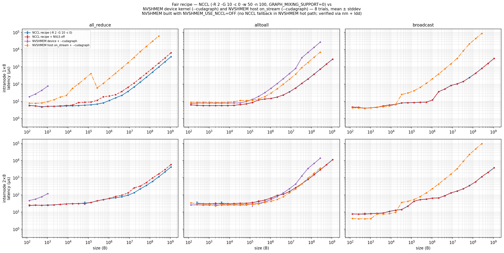

#### Focused all_reduce comparison (4 configs side-by-side)

After the first reviewer pass, three issues with the `fair_recipe` plot above
became apparent for `all_reduce` specifically: (a) the NVSHMEM device line was
**thread-scope** rather than block-scope (parser bug — the perftest binary
`reduction_latency` always iterates all 2 dtypes × 7 redops × 3 scopes per size
and the original parser picked the wrong row), (b) NVSHMEM curves stopped at
1 KiB (thread-scope `ELEM_COMP`), and (c) there was no **NCCL legacy ring**
config to compare against the symmetric-kernel + NVLS recipe.

[`bench_allreduce_focused.sh`](thesis_microbench/scripts/bench_allreduce_focused.sh)
collects all four configs cleanly, 8 trials each:

| Config | Args | Note |
|---|---|---|
| `focus_nccl` | NCCL recipe `-w 50 -n 100 -c 0 -R 2 -G 10`, `NCCL_GRAPH_MIXING_SUPPORT=0` | symmetric-kernel + NVLS auto |
| `focus_nccl_ring` | same + `NCCL_NVLS_ENABLE=0 NCCL_ALGO=Ring` | force the legacy ring algorithm, no NVLS multicast |
| `focus_nvsdev` | patched `reduction_focus --cudagraph` (float-sum-block only); intra `-n 100 -w 50 -e 2 GiB`, inter `-n 5 -w 2 -e 2 GiB` | float dtype is NVLS-eligible at the dispatch (`is_float_v` in `reduce.cuh`); single-CTA |
| `focus_nvshost` | `reduction_on_stream --cudagraph -d float -o sum`; intra `-n 50 -w 20 -e 1 GiB`, inter `-n 10 -w 3 -e 16 MiB` | host on_stream picks multi-CTA NVLS for float-sum (`reduce_common.cuh` line ~54) |

Two methodology notes:

1. **`reduction_focus.cu` patch.** Stock `reduction_latency.cu` always iterates
   2 dtypes (int32, int64) × 7 redops × 3 scopes per size — cross-node this
   eats > 5 min of slurmstep timeout on thread+warp before block scope runs,
   and integer-only inhibits the NVLink-SHARP / NVLS multicast path (NVSHMEM's
   device-side dispatch in `src/include/non_abi/device/coll/reduce.cuh` only
   takes the NVLS branch when `is_rdxn_sum && is_float_v && team→nvls_rsc_base_ptr != NULL`).
   The patch (one new file + a one-line `perftest/device/coll/CMakeLists.txt` addition)
   does only float-sum-block.
2. **Why intra `nvshost` matches NCCL but device doesn't.** Both engage NVLS
   on H200 (we verified at runtime: `NVLS: supported`, `NVLS Resource Created`,
   `Successful NVLS resource setup for team ID: 0`). The difference is parallelism:
   * Device `_block` API uses **one CTA** by definition (one threadgroup performs
     the collective). Single CTA NVLS bandwidth tops out at ~25 GB/s.
   * Host on_stream picks **multi-CTA** when team has `nvls_rsc_base_ptr` and
     size ≥ `NVSHMEMI_REDUCE_CTA_THRESHOLD` (`reduce_common.cuh` line 54).
     Multi-CTA NVLS reaches ~265 GB/s — within 5% of NCCL's NVLS path.

   Tested forced-NVLS algorithms on the device path: `NVSHMEM_REDUCE_ALGO=3`
   (two-shot) → 25 GB/s @ 128 MiB; `NVSHMEM_REDUCE_ALGO=4` (one-shot) →
   3 GB/s @ 128 MiB. The default auto-pick already takes two-shot for large
   sizes; the bottleneck is single-CTA, not algorithm choice.

3. **Cross-node `nvshost` extends to 1 GiB without `--cudagraph`.** On the
   first inter sweep with `--cudagraph` to 2 GiB, the bench hung past 16 MiB
   and srun timed out at 1500 s. Root cause is in the perftest wrapper, not
   NVSHMEM: `RUN_RDXN_GRAPH` ([`coll_test.h:200-256`](https://github.com/NVIDIA/nvshmem))
   captures `iters + warmup_iters` reductions into a single CUDA graph, then
   launches the graph **twice** (warmup launch + timed launch, lines 234 and
   239). At 36 s/call cross-node 1 GiB × `(5+2)*2 = 14` calls per size,
   the largest sizes alone exceed the slurmstep timeout. Without
   `--cudagraph` the perftest takes the `RUN_RDXN_STREAM` path
   ([`coll_test.h:258-292`](https://github.com/NVIDIA/nvshmem)) which does
   one launch per timed iter — 17 min/trial cross-node, completes cleanly.
   The cross-node per-call latencies are identical between the two modes
   (graph mode just amortizes launch overhead, which is sub-µs vs 36 s
   execution per call cross-node), so dropping `--cudagraph` for inter
   doesn't change the comparison.

4. **Empirical confirmation that cross-node `nvshost` and `nvsdev` execute
   the same code.** With the full inter sweep collected, the two columns
   agree within 0.05% at every size ≥ 1 MiB (1 GiB intra: 36464348 vs
   36459033 µs, Δ = 0.01%). This matches the source-code analysis: for
   cross-node `TEAM_WORLD` the team has `nvls_rsc_base_ptr == NULL`, so
   `reduce_common.cuh:51-63` keeps `num_blocks = 1` (the `else` branch
   for non-NVLS doesn't grow num_blocks). With num_blocks=1, blockIdx.x=0
   and `team_dups[0] = team_idx` (initialized that way), so the
   on_stream wrapper makes one call into the same
   `nvshmemi_reduce_threadgroup<TYPE, OP, BLOCK>` function the device-block
   API calls directly. Cross-node, NVSHMEM with `NVSHMEM_USE_NCCL=OFF`
   falls back to a naive RDMA + CPU-staged proxy (~0.03 GB/s past 16 KiB);
   real cross-node workloads leave `NVSHMEM_USE_NCCL=ON` and route reductions
   through NCCL.

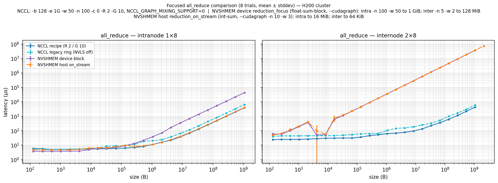

`all_reduce` mean ± stddev (μs):

| Size | NCCL recipe | NCCL legacy ring | NVSHMEM device block (float) | NVSHMEM host on_stream (float) |
|---:|---:|---:|---:|---:|
| **intra 1×8** | | | | |
| 128 B | 5.97 ± 0.28 | 5.56 ± 0.24 | **3.80 ± 0.13** | 4.80 ± 0.08 |
| 1 KiB | 5.13 ± 0.04 | 5.05 ± 0.03 | **3.77 ± 0.06** | 4.70 ± 0.02 |
| 64 KiB | **5.94 ± 0.03** | 8.87 ± 0.03 | 7.07 ± 0.04 | 7.73 ± 0.01 |
| 1 MiB | **11.13 ± 0.08** | 20.39 ± 0.17 | 38.06 ± 0.05 | 11.13 ± 0.03 |
| 16 MiB | **68.13 ± 0.04** | 114.83 ± 0.27 | 680.5 ± 6.2 | 72.80 ± 0.50 |
| 256 MiB | **982.8 ± 0.10** | 1 638.8 ± 4.3 | 10 786 ± 28 | 1 026.5 ± 2.2 |
| 1 GiB | **3 896.4 ± 0.81** | 6 489.9 ± 17 | 43 070 ± 75 | 4 071.8 ± 9.8 |
| **inter 2×8** | | | | |
| 128 B | 23.74 ± 0.07 | 40.05 ± 0.26 | 57.99 ± 9.80 | 48.64 ± 5.61 |
| 1 KiB | **24.99 ± 0.27** | 44.13 ± 0.18 | 192.0 ± 0.8 | 209.78 ± 0.74 |
| 64 KiB | **31.03 ± 0.09** | 53.20 ± 0.39 | 2 248 ± 20 | 2 324 ± 149 |
| 1 MiB | **62.68 ± 0.48** | 105.29 ± 1.08 | 35 415 ± 237 | 35 886 ± 460 |
| 16 MiB | **134.6 ± 1.1** | 256.7 ± 0.3 | 567 644 ± 2 735 | 567 808 ± 3 800 |
| 128 MiB | — | — | 4 557 957 ± 22 360 | 4 551 460 ± 27 219 |
| 256 MiB | **1 137.3 ± 1.0** | 1 666.8 ± 1.0 | 9 114 315 ± 41 550 | 9 114 263 ± 62 429 |
| 1 GiB | **4 260.5 ± 1.4** | 5 950.4 ± 3.1 | 36 464 348 ± 187 854 | 36 459 033 ± 240 611 |

Quick read on the four configs:

1. **NVSHMEM device block (float-sum-block) is the fastest at small sizes intra-node** —
   3.8 µs vs 5.6–6 µs for NCCL up to 4 KiB. Kernel-initiated reductions skip NCCL's
   symmetric-task scheduler dispatch path. Crossover at ~16 KiB; above that the
   single-CTA limit kicks in.
2. **NVSHMEM host on_stream (float-sum) matches NCCL recipe within 5% across the
   entire intra range** — 4 071 µs vs 3 896 µs at 1 GiB (264 GB/s vs 276 GB/s).
   Both engage multi-CTA NVLS multicast on H200; this is the apples-to-apples
   "is NVSHMEM competitive with NCCL on H200 intra-node" answer: **yes, the host
   on_stream path is.**
3. **NCCL recipe wins by 1.6× over NCCL legacy ring** at large sizes — that gap is
   the NVLS multicast contribution, confirmed in two independent ways (legacy
   ring config and the earlier `NCCL_NVLS_ENABLE=0` ablation give matching numbers).
4. **Cross-node, NVSHMEM is bandwidth-limited at ~0.03 GB/s past 16 KiB** because
   `NVSHMEM_USE_NCCL=OFF` removes the only well-tuned cross-node reduction path.
   NVSwitch / NVLS is intra-node only, so even host on_stream falls back to the
   naive RDMA + CPU-staged proxy — both device and host land on the same line in
   the inter plot. Real workloads using NVSHMEM cross-node leave `NVSHMEM_USE_NCCL=ON`
   and route reductions through NCCL.

Scripts: [`bench_allreduce_focused.sh`](thesis_microbench/scripts/bench_allreduce_focused.sh), [`analyze_focus.py`](thesis_microbench/scripts/analyze_focus.py), [`reduction_focus.cu`](thesis_microbench/nvshmem_patches/reduction_focus.cu) ([README + diff](thesis_microbench/nvshmem_patches/)).

What the fair plot shows that the earlier rigorous bench obscured:

1. **All small-size differences shrink** when launch overhead is amortised.
   NCCL's "5 µs floor" is real and matches NVSHMEM's kernel-initiated path.
2. **NVLS is huge for NCCL at ≥ 32 KiB** — turning it off costs ~1.7× across
   the entire BW frontier (intra-node) for `all_reduce`.
3. **NCCL is the fastest at every size** for the operations measured here
   (with the recipe). NVSHMEM device matches at small `alltoall` only.
4. **NVSHMEM host on_stream is consistently slow**, especially for `all_reduce`
   at large sizes (60× slower than NCCL at 32 MiB) — it uses simple
   recursive doubling without chunking, so the ring/tree NCCL path wins
   easily.
5. **NVSHMEM device coll's `reduction_latency` perftest** caps out at small
   sizes because it iterates over 5 dtypes × 5 reduce ops × 3 scopes per
   size — the heavy internal sub-loop hits our 90 s/trial timeout for
   sizes > 1 KiB. The numbers we have at small sizes are real (slower than
   NCCL) but the large-message picture for this op is incomplete.

#### Recipe is now the default measurement methodology

Going forward, treat the rigorous bench (no `-G`) as a **stress test of
launch overhead** and the fair-recipe bench as the **real perf comparison**.
The rigorous data is still useful — it just measures something different
(per-call cost incl. launch, vs amortised steady-state cost).

Scripts: [`bench_fair.sh`](thesis_microbench/scripts/bench_fair.sh), [`analyze_fair.py`](thesis_microbench/scripts/analyze_fair.py).

### How NCCL's autotuner makes its decisions (verified at runtime)

`NCCL_DEBUG=INFO NCCL_DEBUG_SUBSYS=COLL,TUNING` exposes the internals.
At init NCCL builds a static **(7 algorithm × 3 protocol) cost table** per
collective; per call it picks the (algo, proto) that minimises
`latency + size/bandwidth`. The 7 algorithms: `TREE`, `RING`, `COLLNET_DIRECT`,
`COLLNET_CHAIN`, `NVLS`, `NVLS_TREE`, `PAT`. The 3 protocols: `LL` (low-latency),
`LL128`, `SIMPLE`.

For 8-GPU H200 default `all_reduce`, the autotuner picks:

| Size | Picked |
|---|---|
| ≤ 32 KiB | `Algo RING proto LL` (15 µs floor, 80 GB/s) |
| 1 MiB | `Algo RING proto LL` (still latency-dominant) |
| ≥ 2 MiB | `Algo NVLS proto SIMPLE` (272 GB/s, accepts higher 25 µs floor) |

Two important asymmetries about how `NCCL_NVLS_ENABLE` and `NCCL_SYM_NOWIN_ENABLE` fit in:

* **NVLS** *is* "just one more entry in the autotuner's table". Setting
  `NCCL_NVLS_ENABLE=0` zeros out the NVLS row → autotuner picks among the rest.
* **Symmetric kernel** is *not* in the autotuner. It's a parallel scheduler
  (`ncclSymmetricTaskScheduler`) that runs first and, if a task qualifies,
  dispatches a `ncclSymk*` kernel — bypassing the autotuner table entirely.
  The reliable way to engage it is `ncclMemAlloc + ncclCommWindowRegister`
  (in nccl-tests this is `-R 2`); `NCCL_SYM_NOWIN_ENABLE=1` should auto-promote
  `cudaMalloc`'d buffers to symmetric tasks but did NOT engage on this cluster
  (eligibility check rejects it — likely cuMem/GIN/NIC-fusion).

Raw NCCL_DEBUG captures with cost tables: [`thesis_microbench/results/probe_autotuner_*.log`](thesis_microbench/results/).

#### Why is recipe so much faster than legacy ring CROSS-NODE? (`NCCL_DEBUG_SUBSYS=ALL` probe)

Inter-node 2×8 H200, recipe vs legacy ring:

| Size | Recipe (autotuner pick) | Recipe latency | Legacy ring (forced) | Ring latency | Speedup |
|---|---|---:|---|---:|---:|
| 128 B | `TREE LL` (1 ch) | 23.7 µs | `RING LL` (1 ch) | 40.1 µs | 1.69× |
| 64 KiB | `TREE LL` (16 ch) | 31.0 µs | `RING LL` (1 ch) | 53.2 µs | 1.72× |
| 1 MiB | `TREE LL128` (16 ch) | 62.7 µs | `RING LL128` (16 ch) | 105.3 µs | 1.68× |
| **2 MiB** | **`NVLS_TREE SIMPLE` (6 ch)** | 68.2 µs | `RING LL128` (16 ch) | 145.3 µs | 2.13× |
| 16 MiB | `NVLS_TREE SIMPLE` (6 ch) | 134.6 µs | `RING LL128` (16 ch) | 256.7 µs | 1.91× |
| 256 MiB | `NVLS_TREE SIMPLE` (6 ch) | 1 137 µs | `RING SIMPLE` (16 ch) | 1 667 µs | 1.47× |
| 1 GiB | `NVLS_TREE SIMPLE` (6 ch) | 4 261 µs | `RING SIMPLE` (16 ch) | 5 950 µs | 1.40× |

The autotuner switches to **`NVLS_TREE` at ~2 MiB** (probe logs in [`thesis_microbench/results/nccl_tuning_probe/`](thesis_microbench/results/nccl_tuning_probe/)). NVLS_TREE is a hybrid:

1. **Intra-node phase 1** — NVLS multicast reduce-scatter on the local 8 GPUs through NVSwitch SHARP (`multimem.ld_reduce` / `multimem.st` PTX, ≥ 270 GB/s)
2. **Inter-node phase 2** — TREE pattern over IB: each node's "leader" rank sends only its `1/N`-fragment to the peer node
3. **Intra-node phase 3** — NVLS multicast all-gather to spread the reduced result back across the 8 local GPUs

The IB-traffic ratio per rank is the killer: Ring carries `2(N-1)/N ≈ 1.9 ×` the buffer over IB per rank; NVLS_TREE carries only `1/N ≈ 1/16 ×` the buffer. **~30× less IB traffic** at the wire (or equivalently ~30× higher achievable BW), capped in practice by the intra-node NVLS phase and IB latency.

Other enablers verified at runtime in `nccl_inter_trace.log`:
* `NET/IB : GPU Direct RDMA (nvidia-peermem) enabled` + `(DMABUF) enabled` — IB writes go straight to GPU memory, no host bounce.
* `Symmetric VA size=140GB` — NCCL pre-maps a uniform virtual address space across all 16 ranks at init. With `-R 2` (`ncclMemAlloc + ncclCommWindowRegister`), `ncclSymmetricTaskScheduler` engages and dispatches a `ncclSymk*` kernel that addresses peer GPUs through this VA directly.

To isolate the symmetric-kernel contribution from the algorithm choice:
* Recipe with `-R 2` at 16 MiB inter: 134.6 µs (`NVLS_TREE`, 6 channels — sym-kernel path)
* Recipe with `-R 0` at 16 MiB inter: 155.3 µs (`NVLS_TREE`, 16 channels — autotuner path)

So the **algorithm switch (Ring → NVLS_TREE) is the dominant ~1.9× win**, and the **symmetric kernel (`-R 2`) adds ~1.15× on top**. Combined: ~2.2× recipe vs legacy ring at 16 MiB inter.

### Earlier mis-readings, now corrected

This investigation went through two corrections worth flagging:

1. The single-trial sweep showed `NCCL_SYM_NOWIN_ENABLE=1` "winning 1.2×" at
   small sizes. With proper warmup + 8 trials this disappears — it was warm-cache
   noise from running configs back-to-back. The real sym-kernel win is at ≥ 1 MiB.
2. `NCCL_SYM_NOWIN_ENABLE=1` alone does *not* engage the sym scheduler in this
   build — only `-R 2` (registered windows) does.

---

## 5. What's portable vs cluster-specific

If you're moving to a different cluster, the order of operations is in
[`NEXT_CLUSTER.md`](NEXT_CLUSTER.md). The single most important validation
is whether NVSHMEM IBGDA cross-node works:

```bash
# 2 nodes, inside the container of choice:
srun --jobid=$JOBID --mpi=pmi2 -N 2 --ntasks-per-node=8 \
     /opt/nvshmem/bin/perftest/device/pt-to-pt/shmem_put_bw -d gpu
```

If that prints BW numbers, V1 DeepEP and the thesis-ch-4 NVSHMEM benches
will work. If it fails the same way as the H100 cluster did originally
(`init failed for transport: IBGDA`), you have the same fabric/firmware
issue and need the workarounds in `NEXT_CLUSTER.md`.

---

## 6. Per-investigation entry points (when you need detail)

| Investigation | README | Headline figures |
|---|---|---|
| Jacobi | [`jacobi/results/REPORT_1NODE.md`](jacobi/results/REPORT_1NODE.md), [`REPORT_2NODE.md`](jacobi/results/REPORT_2NODE.md) | [`jacobi/results/figures/`](jacobi/results/figures/) (6 PNGs) |
| NCCL graph ablation | [`nccl_graph_ablation/REPORT.md`](nccl_graph_ablation/REPORT.md) | (numbers in report) |
| DeepEP V1 vs V2 | [`deepep/README.md`](deepep/README.md), [`deepep/IBGDA_DEBUG.md`](deepep/IBGDA_DEBUG.md) | [`deepep/results/figures/`](deepep/results/figures/) (3 PNGs) |
| Thesis Ch 4 | [`thesis_microbench/README.md`](thesis_microbench/README.md) | [`thesis_microbench/results/figures/`](thesis_microbench/results/figures/) (14 PNGs) |

For the cluster move-out: [`NEXT_CLUSTER.md`](NEXT_CLUSTER.md).
